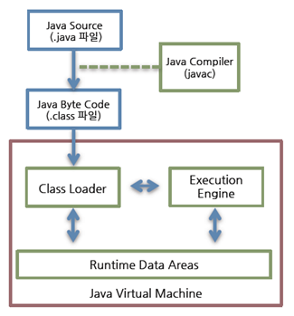

# static 제어자

사용하는 코드 전역에서 사용하는 변수는 어떻게 생성하면 효율적일까요?

변수를 한 번 생성하고, 이를 전역적으로 공유해서 사용하면 됩니다.

자바에서는 static 제어자를 통해 변수를 공용공간에 저장하고 사용할 수 있습니다.

자바 실행 시점에 생성되는 이 공용 공간은 런타임 데이터 영역(`Runtime data area`)이라 부르며, static 변수는 런타임 데이터 영역 안의 `method area` 에 저장되게 됩니다.


예를 들어 `main.java` 파일을 컴파일러를 통해 컴파일하면, `main.class` 가 생성됩니다. 그리고 `java` 명령어를 통해 클래스파일을 실행하면, 아래와 같이 JVM 실행 환경이 구성됩니다.

그 중 Runtime Data Areas 에 우리가 선언한 변수가 저장되는데, Method Area 에 static 변수가 저장됩니다.

<figure><figcaption><p>자바 컴파일 및 실행 (출처: <a href="https://d2.naver.com/helloworld/1230">https://d2.naver.com/helloworld/1230</a>)</p></figcaption></figure>

<figure><figcaption><p>런타임 데이터 영역 (출처: <a href="https://d2.naver.com/helloworld/1230">https://d2.naver.com/helloworld/1230</a>)</p></figcaption></figure>

참고로 Runtime Data Areas 에 다양한 저장공간이 있는데, 메소드 호출시에는 메소드 내 필요한 변수들이 Stack(JVM Stack) 영역에 저장되고, new 키워드로 만든 객체들은 Heap 영역에 저장되게 됩니다.

이는 후에 좀 더 자세히 더 배워보겠습니다.


## **Static 변수 (클래스 변수)**

* 클래스의 모든 인스턴스가 공유하는 변수를 정의할 때 사용합니다.
*   객체가 생성되기 전에 메모리에 할당되며, 모든 인스턴스에서 동일한 값을 유지합니다.

    ```java
    public class Counter {
        // static 변수 (클래스 변수)
        public static int count = 0;

        public Counter() {
            // 생성자가 호출될 때마다 인스턴스 수 증가
            count++;
        }

        public static void main(String[] args) {
            // static 변수 접근
            System.out.println("count: " + Counter.count); // 0

            // 인스턴스 생성
            Counter obj1 = new Counter();
            Counter obj2 = new Counter();

            // static 변수는 모든 인스턴스에서 공유되므로 값이 누적됨
            System.out.println("count: " + Counter.count); // 2
        }
    }
    ```


## **Static 메서드**

* 클래스의 인스턴스를 만들지 않고 메서드를 정의할 때 사용합니다.
*   주로 유틸리티 메서드나 정적 팩토리 메서드 등을 구현할 때 활용됩니다.

    ```java
    public class MathUtils {
        // static 메서드
        public static int add(int a, int b) {
            return a + b;
        }

        public static void main(String[] args) {
            // static 메서드 호출
            int result = MathUtils.add(5, 3);
            System.out.println("Result: " + result);
        }
    }
    ```


## **Static 블록 (클래스 초기화 블록)**

* 클래스가 처음으로 로딩될 때 한 번 실행되는 블록으로, 주로 클래스 변수 초기화에 사용됩니다.
*   객체 생성과 관계없이 클래스 로딩 시에 실행됩니다.

    ```java
    public class Counter {
        // static 변수
        public static int count;

        // static 블록 (클래스 초기화 블록)
        static {
            // 클래스 변수 초기화
            count = 10;
            System.out.println("Static Block 초기화");
        }

        public static void main(String[] args) {
            // static 변수 사용
            System.out.println("Static Variable: " + Counter.count);
        }
    }
    ```

`static` 제어자는 객체 간에 데이터를 공유하거나 인스턴스를 만들지않고 작업을 수행하는 데 유용합니다. 이를 통해 메모리 사용량을 줄이고 코드 실행 성능을 향상시킬 수 있습니다.


